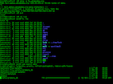
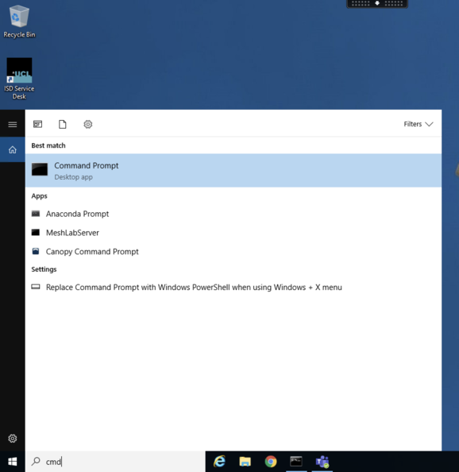
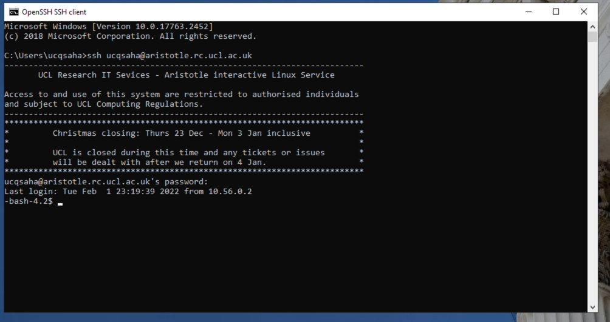
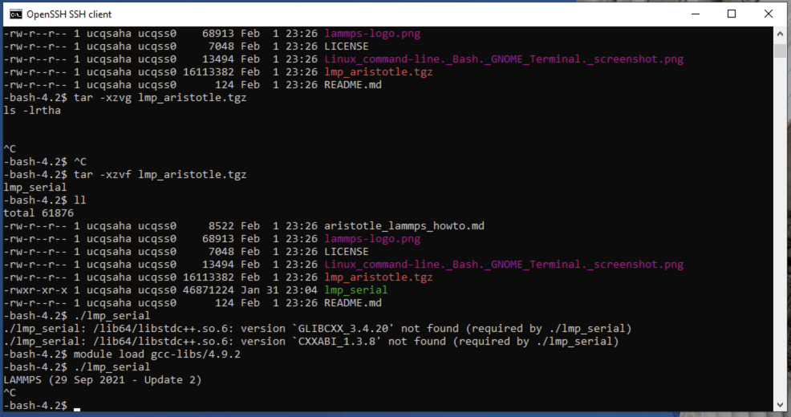

# LAMMPS on Aristotle@UCL

## Introduction 
This is a tutorial for setting up and running Lammps on Aristotle at UCL. 

## What is LAMMPS


LAMMPS stands for Large-scale Atomic/Molecular Massively Parallel Simulator.

LAMMPS is a classical molecular dynamics simulation code with a focus on materials modeling. It was designed to run efficiently on parallel computers. It was developed originally at Sandia National Laboratories, a US Department of Energy facility. The majority of funding for LAMMPS has come from the US Department of Energy (DOE). LAMMPS is an open-source code, distributed freely under the terms of the GNU Public License Version 2 (GPLv2).

## Where can I find more information about LAMMPS
The best source of information is the [LAMMPS home page](https://www.lammps.org) and the [LAMMPS manual](https://docs.lammps.org/Manual.html). LAMMPS is also found on the official [github repository](https://github.com/lammps/lammps).

## What is Aristotle
Aristotle is an interactive, Linux-based compute service for teaching, running on three each node 64 gigabytes of RAM and 16 cores. 
The nodes run the Red Hat Enterprise Linux operating system (RHEL 7)
see [ISD](
 https://www.rc.ucl.ac.uk/docs/Other_Services/Aristotle/) for more information.

## How to connect to Aristotle 
See the official documentation on [UCL-IDS website](https://www.rc.ucl.ac.uk/docs/howto/)

**NOTE**: if you are not connected to the EDUROAM wifi network while st UCL, then you need to use [VPN](https://www.ucl.ac.uk/isd/services/get-connected/ucl-virtual-private-network-vpn) first before connecting to ARISTOTLE (alternatively you van use a gateway but is outside the scope of this how-to)

## You need to use a Terminal for this tutorial!
For this tutorial you need a Terminal program runnig an appropriate shell on your laptop/desktop and connect to a shell (a remote terminal) in Aristotle. .

This is also needed if you are using [UCL Desktop@Anywhere](https://www.ucl.ac.uk/isd/services/computers/remote-access/desktopucl-anywhere)

On **windows** 10/11 you can either 

1. use [putty](https://www.rc.ucl.ac.uk/docs/howto/#windows-putty) or 
2. open a windows "CMD" or Powershell (**prefered* as of the last class practical).

To use CMD, go to the search area in the panel and type cmd or command, it should appear like so: 

 

then click on Command Prompt to launch it, and type in it 

`ssh <ucl_user_id>@aristotle.rc.ucl.ac.uk`

(you can lso use powershell instead). 


For **Mac/Linux** open a Terminal application (use spotlight search to find it) then use ssh to connect to Aristotle as in windows CMD above, i.e., type:

`ssh <ucl_user_id>@aristotle.rc.ucl.ac.uk`

Then you will be asked for the password. **Note while you type the password on the terminal, you will not see anything being typed! this is to make sure now one sees your password! just type the password carefully and then hit Enter key**

Now you should be logged in and get something similar to the following prompt: 



For much more tharough information and help about the linux/Mac (in fact, more generally UNIX) Terminal see [A guide to the Linux terminal for beginners](https://opensource.com/article/21/8/linux-terminal) and a nice intro to the [main commands you need in a terminal](https://www.redhat.com/sysadmin/10-commands-terminal).

## Setting up Lammps on Aristotle 
**NOTE: Please do not yet try this as there is a bug on Aristotle and our Research Computing devision is taking care of it, in the mean time, please copy an executable from this repo. **

Lammps is one of the supported and already available packages but it needs to be activated. Once you are logged in execute the following commands: 

 ~~`_> module load gcc-libs/4.9.2`~~


~~`_> module load compilers/intel/2018/update3`~~

~~`_> module load mpi/intel/2018/update3`~~

~~`_> module load lammps/7Aug19/userintel/intel-2018`~~


Note: run each command separately by copy and pasting the entire line and hitting enter afterwards. If there are issues, please submit an issue or email me directly. 

Each of these commands will enable various parts of the environment needed to run Lammps (e.g., defining which compilers, libraries and executable to load into your path)

Once these commands have run, you should have the executable `lmp_default` in your path and you are ready to move to the next section. 

### Temporary solution for getting LAMMPS on ARISTOTLE
Until the module procedure is fixe, you should clone the lammps-tutorial repository from https://github.com/materials-discovery/Lammps_tutorials.git like so: 

* Assuming you are already logged into Aristotle then type the following:

```git clone https://github.com/materials-discovery/Lammps_tutorials.git```


* this will clone this repository to your local folder names Lammps_tutorials. 

* now enter into the lammps_tutorials folder: 

```cd Lammps_tutorials```

* there is a file called `lmp_aristotle.tgz`, which is a tar archive, lets extract it: 

``` tar -xzvf lmp_aristotle.tgz```

Now you will have an executable file called `lmp_aristotle` in the `Lammps_tutorials folder`. However, if you try to run it by writing the command 

`lmp_aristotle' then pressing Enter, you get an error indicating some missing linraries, this is because you need still to load the compiler into your environment, so do the following: 

`module load gcc-libs/4.9.2`

then you can type the `lmp_aristotle` and it will work, it will show something like below: 



### Prepare a folder for working on the tutorials 
It is a good practice to create a new folder for each project/tutorial. In this case reate on Aristotle (using the terminal) a new folder in the home or main folder named "lammps_tutorial_1" like so: 

type: 

* `cd ` + Enter to return to the main folder of your account. 
* `mkdir lammps_tutorial_1` + Enter to create 
* `cd lammps_tutorial_1`  + Enter to enter this new folder. (from now on we will assume an Enter at the end of each command!)

now if you list the contents of your home folder on Aristotle like so 


### Clone the LAMMPS GitHub Repository
we want to use some LAMMPS examples, the easiest way to get them directly to your account in Aristotle is to clone the entire LAMMPS repository, this way not only the examples are available, but also the documentation and the source code. Of course you can later delete any folder you do not want using the `rm ` command. 

We shall use some of the official LAMMPS tutorials. 

Do in the terminal within the folder (press Enter at the end of each line to execute it)

* `cd ` + Enter, to got the home folder
* `git clone  https://github.com/lammps/lammps.git` 

this will take a while, once the entire repository is cloned, you can browse it using `cd <folder>
` and `cd ..` etc. 

### Run the simple Melt Example: 

do the following
* `cd ` + Enter, to got the home folder
* `cd lammps_tutorial_1`
* `cp -r ~/lammps-29Sep2021/examples/melt/ .' --> this will copy the entire melt folder from the lammps examples to your lammps_tutorial_1 folder
* `cd melt`
* ~/Lammps_tutorials/lmp_aristotle -i in.melt`

**Congratulations! you run the first lammps simulation**

### Inspect the LAMMPS Input file
Lets inspect the lammps input file `in.melt`. 

One option is to use [scp or winscp]((https://www.rc.ucl.ac.uk/docs/howto/#windows-winscp)) and copy the file to your desktop/laptop, view, edit, change etc., then use scp or winscp but in this tutorial we will edit the file directly on Aristotle using the simple text editor program called [nano](https://www.nano-editor.org) (if you are familiar with it, or are feeling adventures ;-), you may try to learn [vim](https://opensource.com/article/19/3/getting-started-vim)). 

First we activate nano (we need to do this every time we log in to Aristotle):

* `modeule load nano`

now run 

* `nano in.melt`  and use the arrow keys to move arround. Identify all the various parts of the input file, and consult the lammps manual for help! 
  

  Tip: instead of scp/winscp and a CMD terminal, you can use the more advanced, but easy to use  [MobaXterm](https://www.rc.ucl.ac.uk/docs/howto/#mobaxterm)) program!


## Visualisation of the results 
In order to visualise the results we need to use our laptop/desktop, as remote visualisation may be inefficient. 
* on your laptop/Desktop, if you are windows user, 