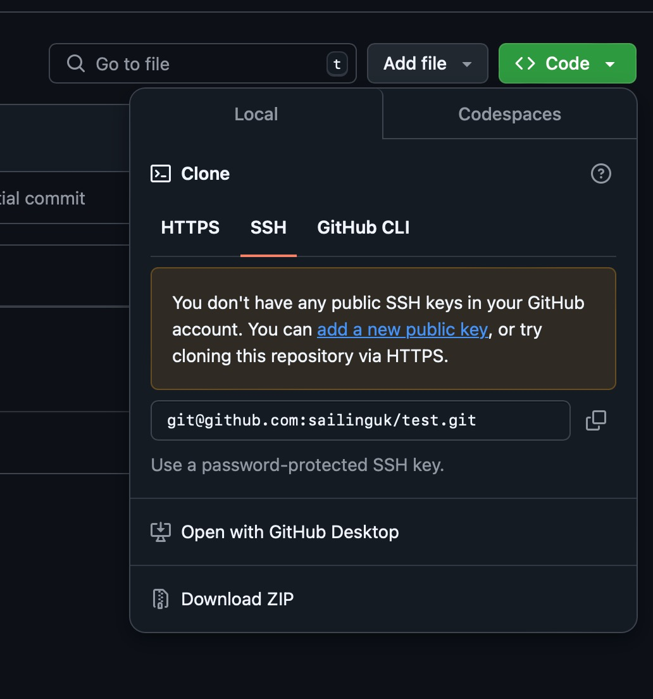

# Setting up GitHub account for cloning with ssh
In order to be able to do

`git clone git@github.com:materials-discovery/Tutorials.git`

You need first to make sure that

1. You have an ssh public key on the server or workstation (or any terminal environment) you are using, this is usually of the form `id_pub.rsa`, and is found in your `.ssh/` folder. If you do not have one, please see **Creating a public key on the local server** below.

2. Make sure this key (the public one) is loaded up in your profile settings on GitHub (or GitLab)

## Creating a public key on the local server

If you don't have an SSH key, like the image below, follow these steps to create one:



<br>


<br>

1. open the terminal, run the command below, which lists all files in the .ssh directory, where SSH keys are usually stored.

`ls .ssh/`

If you have have an SSH key, you might see files like `id_rsa` and `id_rsa.pub`. However, if you don’t have one, you might only see an empty file or just a `known_hosts` file. 

2. enter the `.ssh/` folder by typing the command below, list details of files and folders. 

```bash
cd .ssh/
ll
```


Output should be like below:
```
total 12K\
4.0K drwx------  2 ucaqhaj 4.0K Oct 28 12:20 .\
4.0K drwx------ 21 ucaqhaj 4.0K Oct 30 14:50 ..\
4.0K -rw-r--r--  1 ucaqhaj  385 Oct 30 12:41 known_hosts\
```

3. Generate a new ssh key, run the command `ssh-keygen`, and press enter for several times, until you see such lines.

```
Your identification has been saved in /home/ucaqhaj/.ssh/id_rsa.
Your public key has been saved in /home/ucaqhaj/.ssh/id_rsa.pub.
The key fingerprint is:
SHA256······ucaqhaj@aristotle02.kathleen.ucl.ac.uk
The key's randomart image is:
```
4. At this time, when you type `ls .ssh/` command again, you should see the following line, which means you create your ssh key successfully.

`id_rsa  id_rsa.pub  known_hosts`

5. View the public key by typing `more .ssh/id_rsa.pub`, then copy the long string starting with ssh-rsa, ending with your username and hostname, which looks like the lines below:

`ssh-rsa ····· username@hostname`

6. Adding the SSH Key to GitHub

- Go to GitHub > Settings > SSH and GPG keys.
- Click New SSH key
- type a Title you like,and paste the long string from step 5
- Click `Add SSH key` to save

7. Test the SSH Setup

Try to clone the repository again, using `git clone git@github.com:materials-discovery/Tutorials.git` command, you will see such lines below.
```
Cloning into 'Tutorials'...\
remote: Enumerating objects: 240, done.\
remote: Counting objects: 100% (39/39), done.\
remote: Compressing objects: 100% (32/32), done.\
remote: Total 240 (delta 11), reused 7 (delta 7), pack-reused 201 (from 1)\
Receiving objects: 100% (240/240), 17.34 MiB | 16.00 MiB/s, done.\
Resolving deltas: 100% (113/113), done.\
```

<br>

**Congratulations. You are now set up to use SSH with GitHub and have successfully cloned this repository.**


